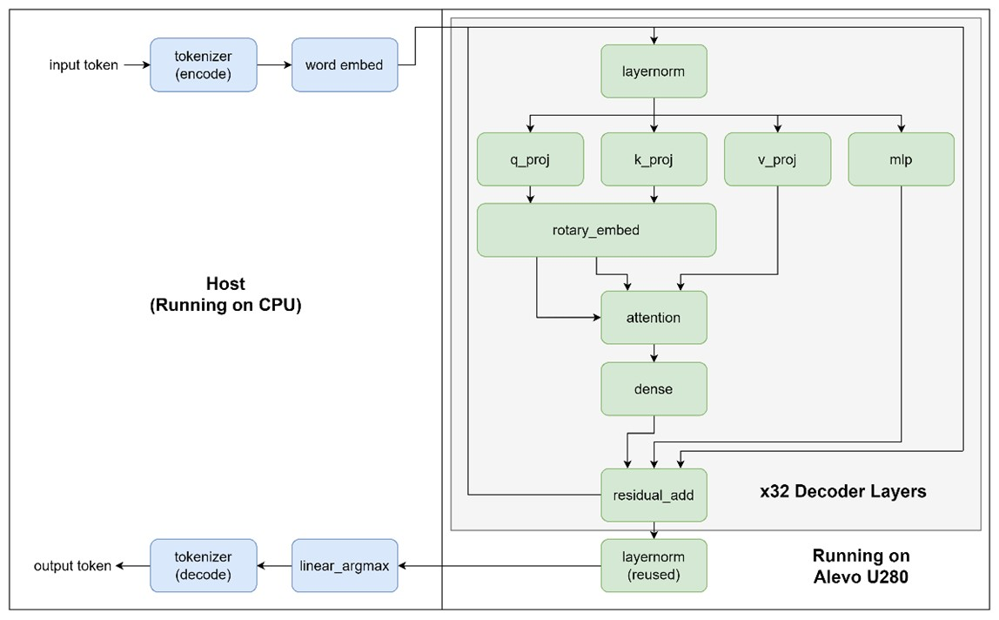
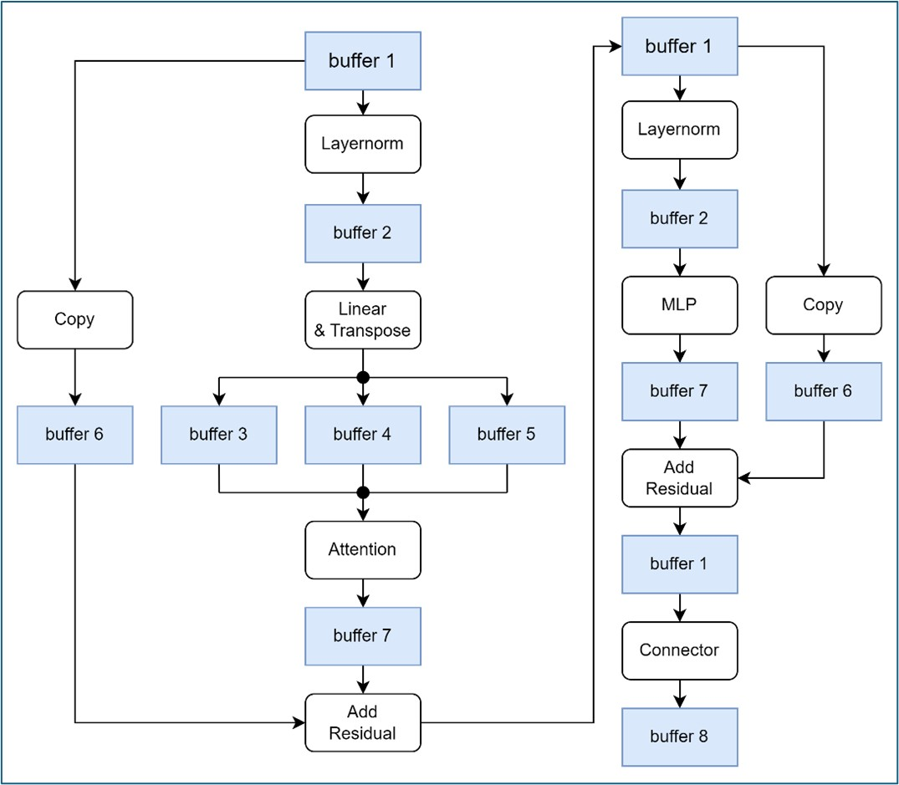
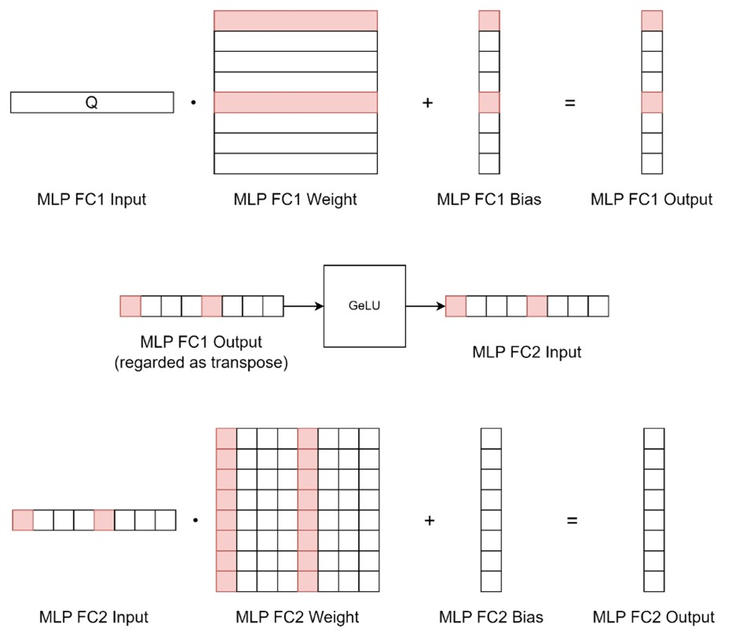
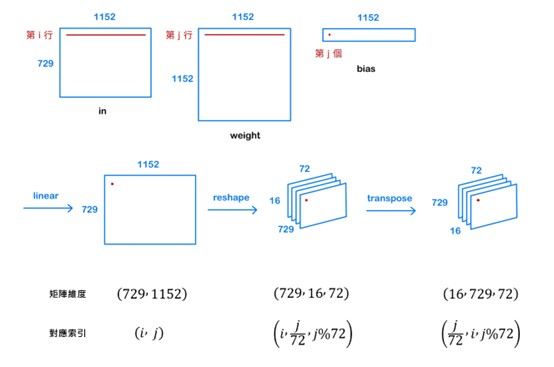

# FPGA-Based Acceleration of TinyLLaVA Inference via High-Level Synthesis

This repository contains the implementation of the **TinyLLaVA-Phi-2-SigLIP-3.1B** multimodal model inference on the **AMD Alveo U280 FPGA**, accelerated using **High-Level Synthesis (HLS)**.

The project focuses on optimizing the Vision Encoder (SigLIP) and Large Language Model (Phi-2) components to overcome memory bottlenecks and maximize computational throughput on resource-constrained hardware.

## 🚀 Project Overview

Deploying Large Multimodal Models (LMMs) on FPGAs presents significant challenges due to limited on-chip memory and memory bandwidth. This project leverages the **Xilinx Vitis** platform to offload compute-intensive kernels to the FPGA, achieving efficient inference through architectural and algorithmic optimizations.

### Key Hardware
* **Platform:** AMD Alveo U280 Data Center Accelerator Card
* **Memory:** 8GB HBM2 (32 Banks) + 32GB DDR4
* **Tools:** Vitis HLS, Xilinx Runtime (XRT), OpenCL

---

## 🏗️ System Architecture

The system implements the full TinyLLaVA pipeline, partitioning the workload between the Host (CPU) and the Kernel (FPGA).
1.  **Vision Encoder (SigLIP):** Processes input images into vision embeddings.
2.  **Connector:** Projects vision embeddings to the language model's space.
3.  **LLM (Phi-2):** Generates text responses based on fused image and text prompts.

### Host Code Implementation
The host code manages tokenization, memory mapping, and controls the generation loop. **This part of the codebase is modified and adapted from the [bol-edu/course-lab_3](https://github.com/bol-edu/course-lab_3) repository (originally targeting Alveo U50, Vitis 2022.1).** We extended it to support the specific memory requirements and kernel interactions of the TinyLLaVA model on the U280.

### Phi-2 Implementation
We partitioned the Phi-2 model into 10 separate kernels for execution on the Alveo U280.

  

<em>Figure 1: System Architecture showing the partition between Host (CPU) and Kernel (FPGA) for the Phi-2 model.</em>

### SigLIP & Connector Implementation
The Vision Encoder requires complex dataflow management. We designed a specific buffering strategy to handle the data dependencies between Layernorm, Linear, and Attention layers.

  

<em>Figure 2: Dataflow and memory buffering strategy for the SigLIP Vision Encoder on FPGA.</em>

### Memory Layout Strategy
Due to the U280's 8GB HBM limit and the model's ~6GB parameter size, we implemented a strict memory allocation strategy:
* **Full Model Storage:** All weights are distributed across **32 HBM banks** to maximize read bandwidth and enable parallel access.
* **Token-by-Token Generation:** Adopted for Phi-2 to minimize runtime buffer requirements, ensuring the KV-cache fits within available memory.

---

## ⚡ Key Optimizations & Methodology

We applied several HLS-specific optimizations to achieve hardware acceleration:

### 1. Algorithmic Improvements

#### Matrix Rotation (Phi-2 MLP)
To address the "storage fragmentation" issue in URAM, we transposed the weights of the MLP FC2 layer. This allows the kernel to compute partial results with a much smaller local buffer (reducing requirements from 2560 to 8 elements), significantly saving on-chip memory.

  

<em>Figure 3: Illustration of the Matrix Rotation strategy in the MLP FC2 layer to minimize on-chip memory usage.</em>

#### Counter-Based Indexing (SigLIP Attention)
Standard implementation of `Reshape` and `Transpose` operations involves expensive division and modulo operations. We replaced these with efficient **counter-based logic**, which tracks `head_num` and `offset` to generate indices directly. This significantly reduced DSP/LUT usage and latency.

### 2. Memory Access Optimization

#### Tiling & Burst Transfers
* **AXI Burst Transfers:** Implemented burst reading (block size = 256) to maximize memory throughput.
* **Tiling Strategy:** Applied to SigLIP and Connector layers (e.g., block size 36) to handle large matrices within limited URAM/BRAM resources.

  

<em>Figure 4: Tiling strategy and optimized counter-based indexing for efficient Attention computation.</em>

### 3. Precision Optimization
* **Fixed-Point Arithmetic:** Converted the majority of Phi-2 MLP calculations from Float16 to **`ap_fixed<40, 16>`**.
* **Mixed Precision:** Maintained FP32/high-precision fixed-point for sensitive layers (Attention, GeLU, Residual Add) to prevent overflow/underflow while optimizing resource usage for other layers.

---

## 📊 Performance Results

### Phi-2 MLP Acceleration
By optimizing memory access and applying fixed-point arithmetic, we achieved a similar speed compared to the baseline Pytorch version running on i9-14900k.

| Version | Precision | Hardware | Execution Time |
| :--- | :--- | :--- | :--- |
| C++ Version | Float32 | CPU (i9-14900k) | 2029.44 s / token |
| Pytorch Version | Float32 | CPU (i9-14900k) | 2.206 s / token |
| Original HLS | Float32 | Alveo U280 | 9.093 s / token |
| **Optimized (v2)** | **Fixed<40,16>** | **Alveo U280** | **3.986 s / token** |

### SigLIP Optimization
Through Tiling and Counter-based indexing, the Vision Encoder performance improved significantly.

| Kernel | Original Time (ms) | Optimized Time (ms) | Speedup |
| :--- | :--- | :--- | :--- |
| Linear | 4502 | 1191 | 3.7x |
| Attention | 20975 | 5601 | 3.7x |
| MLP | 62602 | 8037 | 7.8x |
| **Total (One Layer)** | **88.1s** | **14.8s** | **~5.9x** |

---

## 👥 Contributors

* **You-Ting Liu:**
    * Ported the **Phi-2** model from Python to C++ and verified model correctness.
    * Implemented and accelerated Phi-2 model inference using High-Level Synthesis (HLS).
    * Produced project documentation, including the demo video and poster.
* **Zhi-Yun Lin:**
    * Ported the **SigLIP** model from Python to C++ and verified model correctness.
    * Designed the initial architecture for the SigLIP Host and Kernel code.
    * Authored documentation related to SigLIP and Connector implementation.
* **Zi-En Huang:**
    * Integrated Phi-2 and SigLIP modules to establish the complete **TinyLLaVA** framework.
    * Optimized kernel internal structures and arithmetic logic to improve computational efficiency.
    * Designed and implemented optimal memory access strategies to mitigate bandwidth bottlenecks.

## 📚 References

1. B. Zhou et al., "TinyLLaVA: A framework of small-scale large multimodal models," *arXiv preprint arXiv:2402.14289*, 2024.
2. Tri Dao et al., "FlashAttention: Fast and Memory-Efficient Exact Attention," *arXiv preprint arXiv:2205.14135*, 2022.
3. Hugging Face, "TinyLLaVA-Phi-2-SigLIP-3.1B," [Hugging Face repository](https://huggingface.co/tinyllava/TinyLLaVA-Phi-2-SigLIP-3.1B), 2025.
4. Hugging Face, "Phi model implementation," [GitHub repository](https://github.com/huggingface/transformers/tree/main/src/transformers/models/phi), 2025.
5. Hugging Face, "SigLIP model implementation," [GitHub repository](https://github.com/huggingface/transformers/tree/main/src/transformers/models/siglip), 2025.
6. AMD, "Alveo U280 Data Center Accelerator Card Data Sheet (DS963)," [AMD Technical Information Portal](https://docs.amd.com/r/en-US/ds963-u280/Summary), 2024.
7. AMD, "Vitis High-Level Synthesis User Guide (UG1399)," [AMD Technical Information Portal](https://docs.amd.com/r/en-US/ug1399-vitis-hls/AXI-Burst-Transfers), 2024.
8. AMD, "XRT Essentials (D2-06)," [AMD Technical Information Portal](https://www.xilinx.com/content/dam/xilinx/publications/presentations/D2-06.pdf), 2024.
9. **Host Code Reference:** Adapted from [bol-edu/course-lab_3](https://github.com/bol-edu/course-lab_3) (Board: Alveo U50, Vitis 2022.1).
